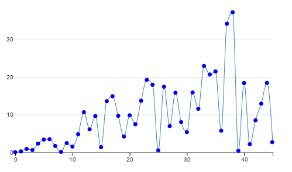
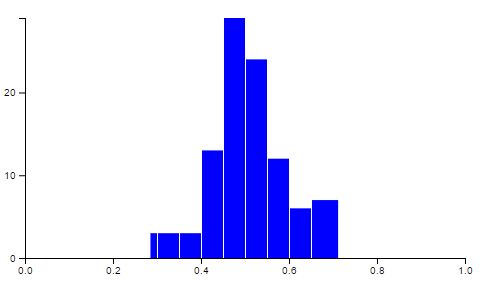
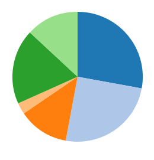

# Project Title

This project includes three charts made with d3.js (line chart, bar chart and pie chart). These are very simple and commented, so it might help you understand some basic principles of d3.

## Screenshots

## Links
* Documentation https://github.com/d3/d3/wiki
* Lots of examples https://bl.ocks.org/
* Understand curve interpolation https://bl.ocks.org/d3noob/ced1b9b18bd8192d2c898884033b5529
* Playground http://phrogz.net/JS/d3-playground/#BlankDefault